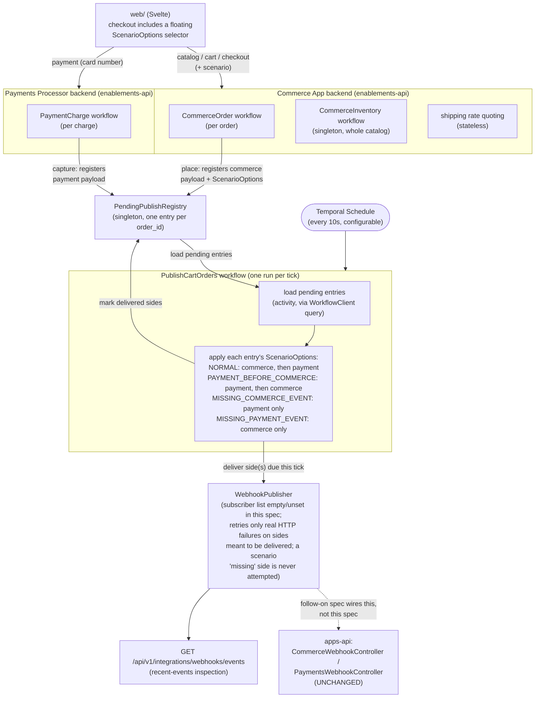

# Feature Specification: Commerce App + Payments Processor (Enablements) with Webhook Pub/Sub

## Overview

**Feature Name:** Commerce App and Payments Processor stateful backends, with generic webhook pub/sub
**Status:** Draft
**Owner:** Temporal PSE Team
**Created:** 2026-09-13
**Updated:** 2026-09-13

### Executive Summary

The OMS ships two real, functional webhook receivers in `apps-api`
(`CommerceWebhookController`, `PaymentsWebhookController`) that feed the
`apps.Order` workflow via `submitOrder`/`capturePayment` updates. Nothing
in the repository actually drives either webhook today: the storefront
catalog and order data are mock endpoints living in `apps-api` itself, and
the payment side (`StripeController`) is a dead stub that never calls
anything. An order can be submitted but can never reach `capturePayment`,
so it can never complete end-to-end in this environment.

This spec builds two standalone, stateful simulators of the external
vendors those webhooks expect to hear from: a **Commerce App** (storefront:
catalog, cart, checkout, its own inventory and shipping-rate quoting) and a
**Payments Processor** (charge authorization and capture, with scenario
outcomes driven by the submitted card number), plus a shared, generic
**webhook publisher** both of them send events through. Delivery is not
immediate: a demo-selectable `ScenarioOptions` value travels with each
order and governs whether, when, and in what order its commerce and
payment events are actually delivered (including reordering them or
dropping one side entirely), so the demo can reproduce the v1 PRD's own
stated integration failure modes. A `PublishCartOrders` workflow, run on a
Temporal Schedule every 10 seconds, is what applies that logic and
performs delivery. This repo has no existing Temporal Schedule usage
today, so this is the first. It deliberately stops short of wiring those
events to the real `apps-api` webhook endpoints: this spec produces
working publishers with an inspectable event log; a follow-on spec adapts
`apps-api` to subscribe to and consume what gets published here, which is
what actually completes an order end-to-end.

Both new backends are built as new capabilities inside the existing
`enablements` module family (`enablements-api`, `enablements-core`,
`enablements-workers`), which is already this repository's home for
simulating external systems (commerce-app validation, PIMS, inventory,
shipping, location-events; see `SPECS/enablements/integrations/spec.md`).
No new deployable Java module is introduced. The existing `web/` SvelteKit
app remains the only frontend and is extended to source its catalog,
cart/checkout, and payment UI from these new backends directly, instead of
from `apps-api`'s mock endpoints.

---

## Goals & Success Criteria

### Primary Goals

- Goal 1: A customer can browse a catalog, add items to a cart, and check
  out through the Svelte UI, producing a durable `CommerceOrder` whose
  submission is registered for delivery as a `commerce.order.submitted`
  event.
- Goal 2: A customer can submit a card at checkout and get a realistic
  authorize/capture/decline outcome from a `PaymentCharge` entity, driven
  by the card number. Reaching `AUTHORIZED` always registers an
  inspection-only `payment.authorized` event; only a successful capture
  additionally registers a `payment.captured` event for delivery (a
  charge that's declined at authorization, voided, or that fails at
  capture time (`CAPTURE_FAILED`) never does, since
  `PaymentsWebhookController` only ever expects a captured payment).
- Goal 3: Both backends publish through one shared, generic webhook
  mechanism (not point-to-point calls into `apps-api`), so a follow-on spec
  can wire a real subscriber without changing this code.
- Goal 4: None of this requires an external account, API key, or network
  access: it runs fully local, matching how the rest of the OMS demo runs.
- Goal 5: A demo operator can select a scenario at checkout (normal,
  payment-before-commerce, missing commerce event, missing payment event)
  and observe the corresponding delivery behavior in the recent-events log,
  demonstrating the v1 PRD's own stated integration failure modes without
  writing new code per scenario.
- Goal 6 (the main intent driving this spec): a human clicking through the
  Svelte checkout and `SPECS/enablements/load-generation/spec.md`'s
  automated load generator submit orders through the **identical** REST
  endpoints (`POST /api/v1/integrations/commerce/orders`,
  `POST /api/v1/integrations/payments/charges`), differing only in who's
  calling and which `ScenarioOptions`/card number they supply. Neither
  gets its own bespoke order-generation path. This is what makes the
  current OMS more approachable: one simulation substrate, reachable by a
  person or by sustained automated load, for the same set of scenarios.

### Acceptance Criteria

- [ ] Catalog, cart, and checkout are served by the new Commerce App
      backend; `web/` no longer calls `apps-api`'s mock catalog/order-list
      endpoints
- [ ] Placing an order creates a queryable `CommerceOrder` workflow and
      registers exactly one pending-publish entry in `PendingPublishRegistry`
      carrying a `SubmitOrderRequest`-shaped payload and the selected
      `ScenarioOptions`
- [ ] Submitting a known "approved" test card authorizes a charge (which
      immediately registers an inspection-only `payment.authorized` entry)
      that auto-captures after a short delay and registers a
      `payment.captured` pending-publish entry with a
      `MakePaymentRequest`-shaped payload
- [ ] Submitting a known "declined"/"insufficient funds" test card returns
      that outcome without ever registering a `payment.authorized` or
      capture entry (the charge never reaches `AUTHORIZED`), and the
      checkout flow surfaces the failure so the customer can retry
- [ ] Submitting the known "capture always fails" test card authorizes
      successfully (registers `payment.authorized`) but the capture
      attempt ends in `CAPTURE_FAILED`, registering no `payment.captured`
      entry, distinct from an operator-chosen `VOIDED` outcome
- [ ] An order can be cancelled after authorization but before capture
      fires, demonstrating the v1 PRD's cancel-before-capture race, with no
      capture entry registered afterward
- [ ] `PublishCartOrders`, running on a 10-second Temporal Schedule,
      correctly applies each of the four scenario presets: normal
      (in-order, both delivered), payment-before-commerce (reordered),
      missing-commerce-event (commerce side never delivered), and
      missing-payment-event (payment side never delivered)
- [ ] A "recent published events" endpoint exists so publication (and
      deliberate scenario-driven non-delivery) can be verified without a
      real subscriber
- [ ] `StripeController` and `apps-api`'s mock catalog/order-list endpoints
      are removed once Commerce App is verified as their replacement

---

## Current State (As-Is)

### What exists today?

- `apps-api`'s `CommerceWebhookController` (`PUT /api/v1/commerce-app/orders/{orderId}`)
  and `PaymentsWebhookController` (`POST /api/v1/payments-app/orders`) are
  real: both use `WorkflowClient.startUpdateWithStart` to start/update the
  `apps.Order` workflow (`submitOrder`, `capturePayment`). They are correct
  and unchanged by this spec: they are the eventual consumer a follow-on
  spec points at what this spec builds.
- `CommerceWebhookController` also hosts `GET /clothing` (a 50-item mock
  catalog) and `GET /orders` (a stub that always returns an empty list);
  these exist only because nothing else owned "the storefront's own data"
  yet. The catalog is not stored anywhere: it is regenerated with
  `java.util.Random` on every single call, so item names and prices are
  different on each request. There is no database, file, or other
  persistence backing it today.
- `StripeController` (`apps-api`) is a dead stub: `createPaymentIntent`
  returns a fabricated client secret; `/webhook` logs and does nothing.
  Nothing in the repository ever calls it from a real payment flow.
- `web/` (SvelteKit, Svelte 5, Tailwind) has working routes
  (`shop/home`, `shop/clothing`, `shop/cart`, `shop/orders`) and an API
  client (`web/src/lib/api/client.ts`) that calls `apps-api`'s mock catalog,
  submits orders to the real commerce webhook, and calls the dead Stripe
  stub for payment.
- `enablements-api`/`enablements-core` already simulate several external
  systems behind `/api/v1/integrations/**`
  (`java/enablements/enablements-api/.../controllers/IntegrationsController.java`):
  commerce-app order validation, PIMS enrichment, inventory address
  lookup/hold/reserve/deduct, shipping (address verify/rates/labels), and
  location-events. `InventoryIntegrationService.holdItems` et al.
  (`enablements-api/.../integrations/InventoryIntegrationService.java:68-94`)
  are pure stateless stubs today: they log the call and return a fixed
  fake ID with `success=true`; nothing is tracked or mutated. Shipping data
  is static fixture JSON loaded once at startup. Both serve the OMS's own
  fulfillment-side warehouse allocation and are unrelated to, and untouched
  by, this spec's Commerce-App-owned inventory/shipping.
- `processing.SupportTeam`
  (`java/processing/processing-core/.../workflows/SupportTeam.java`) is the
  one existing "entity workflow" in this codebase: a fixed workflow ID
  (`"support-team"`), pure `@UpdateMethod` setters plus a `getState()`
  query, no business orchestration. The three `Order` workflows
  (`apps`, `processing`, `fulfillment`) also lean on `getState()` heavily
  but retain real orchestration (activities, timers, `Workflow.await`
  gating, a compensation scope in fulfillment); they are not pure
  state-holders. No workflow anywhere uses a prefixed workflow-ID scheme
  (e.g. `order-{id}`); every case uses the raw entity ID directly.
- No dashboard or denormalized read store exists anywhere in the repo.
  `docs/PROJECT_STATUS.md:91` lists "Customer dashboard" as a literal
  unbuilt checklist item. The v1 PRD's "denormalized data storage to meet
  customer order dashboard UI requirements" was never implemented.

### Pain points / gaps

- Gap 1: No app anywhere produces a `MakePaymentRequest`, so
  `PaymentsWebhookController` is never called and no order can complete.
- Gap 2: The storefront's own data (catalog, cart, order status) is owned
  by `apps-api`, which conflates "the OMS's real webhook ingress" with
  "the simulated commerce vendor's own data": two different bounded
  contexts sharing one controller.
- Gap 3: `InventoryIntegrationService` cannot demonstrate "inventory
  impacted by an order" because it has no real state; this is a distinct
  gap from the missing Commerce-App-owned catalog inventory this spec
  introduces.

---

## Desired State (To-Be)

### Architecture Overview



### Key Capabilities

- Capability 1: Commerce App owns its own catalog, cart-to-order flow, a
  per-catalog inventory ledger, and checkout-time shipping rate quoting,
  all inside `enablements`, with no new deployable service.
- Capability 2: Payments Processor authorizes and captures/declines
  charges deterministically from the submitted card number, with a
  configurable auto-capture delay and an explicit early-capture/void path
  for demonstrating the cancel-before-capture race from the v1 PRD.
- Capability 3: A single, reusable `WebhookPublisher` activity delivers
  events to configured subscriber URLs with Temporal-native retry, and
  exposes a recent-events log for verification without a real subscriber.
- Capability 4: A demo-selectable `ScenarioOptions` value, carried on each
  order, drives a scheduled `PublishCartOrders` workflow to deliver
  commerce/payment webhook events normally, out of order, or with one side
  deliberately withheld, reproducing the v1 PRD's own integration failure
  modes ("inputs arrive... in different sequences," "inputs might never
  arrive") on demand.

---

## Technical Approach

### Design Decisions

| Decision | Rationale | Alternative Considered |
|----------|-----------|------------------------|
| Build both backends inside the existing `enablements` module family | `enablements` is already this repo's home for simulating external systems; avoids a new deployable service and keeps the local-demo footprint small | New standalone Java/Python/Node service per app: more realistic process boundary, but more setup/runtime footprint for a local demo |
| Reject real Stripe (even test mode) | This runs as a local demo other people pull and run with no setup; a Stripe account/API key/CLI login is unacceptable friction even though test mode is free and fully functional | Real Stripe test mode with Stripe CLI webhook forwarding, considered and rejected specifically for the no-setup constraint |
| Fold Commerce-App inventory and shipping into the Commerce App itself | Keeps service footprint small; a real commerce platform commonly owns both | Separate simulated "Inventory App" and "Shipping App": more separation of concerns, unnecessary process count for this demo |
| Use singleton/entity Temporal workflows as the backing store for `CommerceOrder` and `PaymentCharge`, modeled on `SupportTeam`'s shape | This repo already runs Temporal for everything; a `SupportTeam`-style workflow (setters + `getState()` query, no heavy orchestration) is a proven, "dead simple" pattern here already | In-memory `ConcurrentHashMap` or an embedded database: simpler, but throws away durability/queryability for free and adds a dependency this repo doesn't otherwise need |
| One `CommerceInventory` **singleton** (catalog-wide), not one workflow per order or per SKU-event | Catalog size is small and fixed; a singleton here is bounded, low-volume, and matches `SupportTeam`'s precedent | One workflow instance per object system-wide (all orders + all inventory + all shipments): rejected because unbounded event-history growth and serialized writes through one execution is a known Temporal anti-pattern |
| `PaymentCharge` workflow ID is the raw `chargeId`, no prefix | Matches every existing workflow-ID convention in this repo (`orderId`, `"support-team"`; no `entity-{id}` style prefix found anywhere) | Prefixed ID (`payments-charge-{id}`): unnecessary since charges live on their own dedicated task queue |
| Card-number-driven scenario table, reusing Stripe's published test-card numbers | No network call, fully deterministic, and the specific numbers are already familiar/documented publicly, at zero cost to reuse as magic values | Random/synthetic outcome generation: less deterministic, harder to demo a specific scenario on purpose |
| Generic webhook pub/sub (subscriber list + HTTP POST via Activity) instead of a direct in-process call into `apps-api` | Lets a follow-on spec register a real subscriber without touching this code; the Activity gets retry semantics for free | Direct HTTP call from `PaymentCharge`/`CommerceOrder` straight into `PaymentsWebhookController`/`CommerceWebhookController`: simpler, but couples the simulator to one specific consumer and forecloses testing publish behavior independently |
| Leave the webhook subscriber list empty/unset in this spec | This spec's job is "produce correct events, inspectably"; wiring a real consumer is explicitly the follow-on spec's job | Wire `apps-api`'s URLs now: would blur the two specs' boundaries and couple this spec's completion to the real OMS's webhook contracts before they're deliberately reviewed together |
| Delivery is scheduled and scenario-driven (`PendingPublishRegistry` + a 10s `PublishCartOrders` Temporal Schedule), not fired inline from `CommerceOrder`/`PaymentCharge`'s own state transitions | Lets the demo reproduce the v1 PRD's own stated failure modes (out-of-order arrival, inputs that never arrive) by design, not by accident; per user direction, a placed order's delivery state persists in a Temporal workflow rather than a database | Publish inline at the moment of state change (original design): simpler, but cannot demonstrate reordering or dropped events, and gives the demo no persisted place to hold "pending, not yet delivered" state |
| `ScenarioOptions` is a small set of named presets (`NORMAL`, `PAYMENT_BEFORE_COMMERCE`, `MISSING_COMMERCE_EVENT`, `MISSING_PAYMENT_EVENT`), selected per order from a floating UI control | Matches "select a scenario for the demo" directly; a named preset is simpler to present in a UI control and to reason about than independent boolean flags | Independent flags (reorder: bool, drop-commerce: bool, drop-payment: bool): more composable, but expands the state space beyond what the demo needs and complicates the UI control |
| Standard Temporal activity retry applies only to sides actually meant to be delivered; a scenario "missing" side is never attempted at all | Keeps "real transient delivery failure" and "deliberate demo scenario" as distinct, non-conflatable outcomes: a missing side is a designed demo state, not a failure to be retried away | Attempt delivery for every side and let scenario logic fail it on purpose (e.g. point at an invalid URL): conflates a demo scenario with a real failure path and would eventually "succeed" after enough retries, defeating the scenario |
| Keep the existing `CommerceIntegrationService` (order validation) name as-is; the new Commerce App backend service gets a distinct name | The new Commerce App backend will eventually call the existing service to perform order validation, so the two are future-adjacent, not colliding, and renaming working code isn't warranted now | Rename the existing service now for symmetry: unnecessary churn to code that already works and isn't actually in conflict |
| React only to `capture`, not `authorization`, when deciding whether an order can complete (i.e. only `payment.captured` reaches `PendingPublishRegistry`'s scenario-gated commerce/payment pair) | Matches `apps-api`'s real webhook contract today: `PaymentsWebhookController` is the only payment endpoint, and `apps.Order`'s only payment update is `capturePayment`; there is no "authorized" webhook in the real system. A fuller design would start order-side work (validation, enrichment, fulfillment prep) at authorization and treat a later capture failure as a parallel compensating action, matching the v1 PRD's own 1-30-day authorize-to-capture window, but that requires a real `apps-api`/`apps.Order` change, out of scope for these specs | Publish/consume an authorization signal now and let the (simulated or real) order side start processing early: more realistic and more Temporal-idiomatic (saga/compensation), but deliberately deferred rather than dropped; still stubbed here as an inspection-only `payment.authorized` event with no consumer, so the follow-on spec can adopt it later without changing the Payments Processor |
| Model an authorization that fails to capture (`CAPTURE_FAILED`) as a distinct terminal state from an operator-chosen `VOIDED` | Real card authorizations don't guarantee eventual capture: the hold can expire (issuer/network TTL, commonly around a week for typical e-commerce authorizations), the capture amount can exceed what was authorized, or the card/account can be closed or frozen before capture. The v1 PRD's "failure to receive a capture notification should cancel the order" rule is modeling exactly this real outcome, not just demo timing, so it deserves its own scenario rather than being folded into `VOIDED` | Treat every non-captured outcome as `VOIDED`: simpler state machine, but conflates "someone explicitly cancelled before we even tried" with "we tried to capture and it genuinely failed," which are different stories worth demoing separately |

### Component Design

#### Commerce App backend (`enablements-api` / `enablements-core`, new package `com.acme.enablements.commerce`)

- **Purpose:** Simulate the external commerce/storefront vendor: catalog,
  cart-to-order, its own inventory, and checkout-time shipping quotes.
- **Responsibilities:**
  - Serve the catalog from a static JSON fixture, replacing `apps-api`'s
    per-request random generator with fixed, deterministic item data,
    the same pattern `ShippingFixtureService` already uses for warehouse
    fixtures (`classpath:/fixtures/shipping-fixtures.json`, loaded once at
    startup). Catalog items (name, price, image) are read-only reference
    data; the only mutable part is stock count, which lives in
    `CommerceInventory` below, keyed by the fixture's item IDs.
  - On checkout, create a `CommerceOrder` workflow (carrying the selected
    `ScenarioOptions`), hold/deduct `CommerceInventory` stock, and register
    a pending-publish entry; delivery itself happens later, on schedule.
  - Serve single-order status lookups for the Svelte order page.
- **Interfaces:**
  - `GET /api/v1/integrations/commerce/catalog`
  - `POST /api/v1/integrations/commerce/orders` (create order from cart)
  - `GET /api/v1/integrations/commerce/orders/{orderId}`
  - `GET /api/v1/integrations/commerce/shipping/rates` (stateless quote)

#### `CommerceOrder` workflow (`enablements-core/.../workflows/`)

- **Purpose:** Hold one placed order's state, including its selected demo
  scenario.
- **Responsibilities:** Record items, shipping address, selected
  shipment/rate, `ScenarioOptions`, and status (`PLACED`); own the
  workflow ID (the order ID, unprefixed, matching existing convention).
- **Interfaces:** `getState()` query; internally calls
  `CommerceInventory.hold` and registers a pending-publish entry (commerce
  payload + `ScenarioOptions`) in `PendingPublishRegistry` on start.
  Does **not** call `WebhookPublisher` directly: actual delivery is the
  scheduled `PublishCartOrders` workflow's job.

#### `CommerceInventory` workflow (`enablements-core/.../workflows/`, singleton)

- **Purpose:** Track per-catalog-item stock levels as one bounded,
  catalog-wide ledger, distinct from and unrelated to the OMS's own
  fulfillment-side `InventoryIntegrationService`.
- **Responsibilities:** `hold`/`release`/`deduct` update methods; `getState()`
  query returning current stock per item ID.
- **Interfaces:** Called by `CommerceOrder` internally; not exposed
  directly over REST (fixed workflow ID, e.g. `"commerce-inventory"`,
  matching `SupportTeam`'s singleton convention).

#### Payments Processor backend (`enablements-api` / `enablements-core`, new package `com.acme.enablements.payments`)

- **Purpose:** Simulate an external payment processor: authorize, capture,
  void, and query charges, with outcomes driven by the submitted card
  number.
- **Responsibilities:** Look up the outcome for a card number (static
  table); start/signal/query the `PaymentCharge` workflow via the
  `WorkflowClient` bean `enablements-api` already has configured for its
  own namespace (`enablements-api/src/main/resources/application.yaml`:
  `TEMPORAL_ENABLEMENTS_NAMESPACE`, `spring.temporal.start-workers: false`;
  client-only today, unchanged by this spec).
- **Interfaces:**
  - `POST /api/v1/integrations/payments/charges`
  - `POST /api/v1/integrations/payments/charges/{chargeId}/capture`
  - `POST /api/v1/integrations/payments/charges/{chargeId}/void`
  - `GET /api/v1/integrations/payments/charges/{chargeId}`

#### `PaymentCharge` workflow (`enablements-core/.../workflows/`)

- **Purpose:** Hold one charge's authorize/capture/void lifecycle.
- **Responsibilities:** Start `AUTHORIZED` or a declined terminal state
  based on the card-number lookup. On reaching `AUTHORIZED`, immediately
  register a `payment.authorized` pending-publish entry (see Design
  Decisions: reacting only to capture, not authorization); this is
  inspection-only today, since no real subscriber consumes it, but keeps
  the door open for a future OMS-side change without touching this
  workflow. Accept `capture`/`void` updates; auto-capture after a
  configurable delay (`Workflow.newTimer`) unless voided first. On
  capture, register a `payment.captured` pending-publish entry against
  the same `order_id` used by `CommerceOrder`. On void, or on a capture
  attempt that fails (see `CAPTURE_FAILED` below), register nothing
  further for the payment side; the order never completes via that path.
- **Interfaces:** `getState()` query; workflow ID = the raw `chargeId`.
  Does **not** call `WebhookPublisher` directly, for the same reason as
  `CommerceOrder`.

#### `WebhookPublisher` (`enablements-core/.../activities/`, shared)

- **Purpose:** One reusable event-delivery mechanism for both backends,
  called only by `PublishCartOrders`, never directly by `CommerceOrder`
  or `PaymentCharge`.
- **Responsibilities:** Given an event type + payload, look up configured
  subscriber URLs for that type (from `acme.enablements.yaml`, empty by
  default in this spec) and POST to each. Retry policy (nailed down now,
  per user direction, rather than deferred): standard Temporal activity
  retry: initial interval 1s, backoff coefficient 2.0, maximum interval
  30s, maximum attempts 5. This applies only to a side `PublishCartOrders`
  actually attempts; a scenario-driven "missing" side is never passed to
  this activity at all, so it is never retried and never appears as a
  failure. Delivery is at-least-once for attempted sides (an activity that
  exhausts retries surfaces as a failed workflow task for that
  `PublishCartOrders` run, visible for debugging, not silently dropped).
  Every attempt (success or exhausted failure) is appended to an in-memory
  recent-events log.
- **Interfaces:** `publish(eventType, payload)` activity method;
  `GET /api/v1/integrations/webhooks/events` (recent-events inspection,
  most-recent-first, bounded ring buffer).

#### `ScenarioOptions` (shared value, not its own workflow)

- **Purpose:** Let a demo operator pick, per order, how its webhook events
  get delivered.
- **Responsibilities:** None at runtime beyond being carried as data: it
  is selected in the Svelte UI's floating checkout control, sent as part
  of `CreateCommerceOrderRequest`, stored on `CommerceOrder`, and read by
  `PublishCartOrders` from the `PendingPublishRegistry` entry.
- **Interfaces:** One of four presets (see Data Model): `NORMAL`,
  `PAYMENT_BEFORE_COMMERCE`, `MISSING_COMMERCE_EVENT`,
  `MISSING_PAYMENT_EVENT`.

#### `PendingPublishRegistry` workflow (`enablements-core/.../workflows/`, singleton)

- **Purpose:** The durable "pending publish" ledger: the persistence
  layer for placed orders awaiting webhook delivery, backed by a Temporal
  workflow rather than a database, per user direction.
- **Responsibilities:** Hold one entry per `order_id`: `ScenarioOptions`,
  the commerce payload once `CommerceOrder` registers it, the payment
  payload once `PaymentCharge` registers it, and a delivered/pending flag
  per side. Because entries are added and later marked delivered
  continuously over a long-running demo, this workflow uses
  `Workflow.continueAsNew` periodically (e.g. every N registrations) to
  keep its own event history bounded. It is a `SupportTeam`-shaped
  ledger, not a heavier orchestrator, and this is the mechanism that keeps
  it that way indefinitely.
- **Interfaces:** Update methods `registerCommerceOrder(orderId,
  scenarioOptions, commercePayload)`, `registerPaymentCapture(orderId,
  paymentPayload)`, `markDelivered(orderId, side)`; query
  `getPendingEntries()` returning every entry with at least one
  undelivered, eligible-for-delivery side. Fixed workflow ID (e.g.
  `"pending-publish-registry"`), matching `SupportTeam`'s singleton
  convention. Called only via activities (from `CommerceOrder`,
  `PaymentCharge`, and `PublishCartOrders`); no workflow calls another
  workflow's query/update directly in-process.

#### `PublishCartOrders` workflow + Temporal Schedule (`enablements-core/.../workflows/`)

- **Purpose:** The actual webhook delivery mechanism, decoupled from
  `CommerceOrder`/`PaymentCharge`'s own state transitions.
- **Responsibilities:** One short-lived workflow execution per tick,
  started by a Temporal Schedule on a 10-second interval (configurable).
  Each run: calls an activity to load pending entries from
  `PendingPublishRegistry`; delivers any pending `payment.authorized`
  entry unconditionally (it is not part of the commerce/payment ordering
  race `ScenarioOptions` governs; see Design Decisions); for the
  commerce/payment pair, applies the entry's `ScenarioOptions` to decide
  what is due this tick (`NORMAL`: commerce then payment, both as soon as
  available; `PAYMENT_BEFORE_COMMERCE`: payment then commerce;
  `MISSING_COMMERCE_EVENT`: payment only, commerce permanently withheld;
  `MISSING_PAYMENT_EVENT`: commerce only, payment permanently withheld);
  calls `WebhookPublisher` for each side that's due; calls an activity to
  mark delivered sides in the registry. A permanently-withheld side is
  simply never marked delivered and never re-attempted; it stays visible
  in the registry as "intentionally pending" for demo inspection.
- **Interfaces:** No REST surface of its own; the Schedule is
  configuration (see Configuration / Deployment). Uses activities (not
  direct workflow-to-workflow calls) for every `PendingPublishRegistry`
  query/update and every `WebhookPublisher` call.

### Data Model / Schemas

New proto messages, following this repo's per-bounded-context
`proto/acme/<context>/domain/v1/*.proto` convention:

`proto/acme/enablements/domain/v1/commerce.proto`:

```protobuf
enum DemoScenario {
  NORMAL = 0;                    // deliver commerce then payment, both delivered
  PAYMENT_BEFORE_COMMERCE = 1;   // deliver payment then commerce (out-of-order)
  MISSING_COMMERCE_EVENT = 2;    // deliver payment only; commerce event never sent
  MISSING_PAYMENT_EVENT = 3;     // deliver commerce only; payment event never sent
}

message ScenarioOptions {
  DemoScenario scenario = 1;
}

message CommerceOrderState {
  string order_id = 1;
  string customer_id = 2;
  repeated acme.oms.v1.Item items = 3;
  acme.common.v1.Address shipping_address = 4;
  optional acme.common.v1.Shipment selected_shipment = 5;
  string status = 6; // PLACED
  google.protobuf.Timestamp placed_at = 7;
  ScenarioOptions scenario_options = 8;
}

message CreateCommerceOrderRequest {
  string customer_id = 1;
  repeated acme.oms.v1.Item items = 2;
  acme.common.v1.Address shipping_address = 3;
  optional acme.common.v1.Shipment selected_shipment = 4;
  ScenarioOptions scenario_options = 5; // from the Svelte checkout's floating scenario selector
}

message CommerceInventoryState {
  map<string, int32> stock_by_item_id = 1;
}
```

`PendingPublishRegistry` entry shape (internal workflow state, not a wire
proto; one entry per `order_id`, held inside the singleton workflow):

```java
record PendingPublishEntry(
    String orderId,
    DemoScenario scenario,
    Optional<String> authorizedPayloadJson, // set once PaymentCharge reaches AUTHORIZED; delivered unconditionally, not scenario-gated
    boolean authorizedDelivered,
    Optional<String> commercePayloadJson,   // set once CommerceOrder registers
    Optional<String> paymentPayloadJson,    // set once PaymentCharge registers (capture only; see Design Decisions)
    boolean commerceDelivered,
    boolean paymentDelivered
) {}
```

`order_id` is the join key between the commerce and payment sides: both
`CommerceOrder` and `PaymentCharge` register against the same `order_id`,
which is how `PublishCartOrders` can apply an ordering/drop rule that
spans both.

Catalog fixture (static, read-only reference data, not a proto, loaded
directly as JSON like `shipping-fixtures.json`):

`enablements-api/src/main/resources/fixtures/commerce-catalog.json`:

```json
{
  "items": [
    {
      "item_id": "APRL-001",
      "name": "Blue T-Shirt",
      "description": "Premium blue t-shirt with modern fit",
      "price_cents": 2500,
      "image_url": "/images/aprl-001.jpg",
      "initial_stock": 25
    }
  ]
}
```

`item_id` carries a category prefix (`APRL-` apparel, `FOOT-` footwear, `ACC-`
accessories, `BAG-` bags) that fulfillment's shipping fixture warehouses use
for SKU-prefix routing (see `shipping-fixtures.json` `warehouses[].sku_prefixes`
and `PimsIntegrationService.enrichOrder`, which passes an unrecognized item's
`item_id` through as its `sku_id` verbatim).

`initial_stock` seeds `CommerceInventory`'s starting `stock_by_item_id`
map at startup; the fixture itself never changes at runtime.

`proto/acme/enablements/domain/v1/payments.proto`:

```protobuf
message PaymentChargeState {
  string charge_id = 1;
  string order_id = 2;
  string customer_id = 3;
  int64 amount_cents = 4;
  string card_last_four = 5;
  string status = 6; // AUTHORIZED | CAPTURED | VOIDED | CAPTURE_FAILED | DECLINED | INSUFFICIENT_FUNDS
  string decline_reason = 7;
  google.protobuf.Timestamp authorized_at = 8;
  optional google.protobuf.Timestamp captured_at = 9;
}

message CreateChargeRequest {
  string order_id = 1;
  string customer_id = 2;
  int64 amount_cents = 3;
  string card_number = 4;
}
```

Webhook event envelope (used by `WebhookPublisher`, not a wire proto;
internal Java record is sufficient):

```java
record WebhookEvent(
    String eventType,       // "payment.authorized" | "commerce.order.submitted" | "payment.captured"
    String payloadJson,     // SubmitOrderRequest- or MakePaymentRequest-shaped JSON
    Instant publishedAt,
    int deliveryAttempts,
    List<String> deliveredTo // subscriber URLs actually POSTed to (empty in this spec)
) {}
```

Only three event types are ever published. `payment.declined` is not one
of them: a charge that's declined at authorization time never reaches
`AUTHORIZED`, so it never registers even a `payment.authorized` entry.
`payment.authorized` (new) is inspection-only today: `WebhookPublisher`
always attempts it (no subscribers configured, so it just lands in the
recent-events log), independent of `ScenarioOptions`. `payment.captured`
is registered only on a successful capture; a voided charge or one whose
capture attempt fails (`CAPTURE_FAILED`, see Data Model below) registers
nothing further, and the order never completes via that path.
`deliveryAttempts` counts only real HTTP retry attempts against a side
that was actually due; a scenario-driven "missing" side never reaches
this record.

Card-number scenario table (`enablements-core`, static):

| Card number (Stripe test values, reused as local magic values) | Outcome |
|---|---|
| any unrecognized number | `AUTHORIZED` (approved), captures normally |
| `4000000000000002` | `DECLINED` at authorization |
| `4000000000009995` | `INSUFFICIENT_FUNDS` at authorization |
| `4000000000000069` | `EXPIRED_CARD` at authorization |
| `4000000000000259` | `AUTHORIZED` successfully, but the capture attempt always fails with `CAPTURE_FAILED` (see Data Model): models a real authorization-expired/issuer-declined-at-capture outcome, distinct from an operator-chosen `VOIDED` |

### Configuration / Deployment

`java/enablements/enablements-core/src/main/resources/acme.enablements.yaml`
gains two new task queues alongside the existing `enablements` and
`integrations` queues:

```yaml
spring.temporal:
  workers:
    - task-queue: commerce
      workflow-classes:
        - com.acme.enablements.commerce.workflows.CommerceOrderImpl
        - com.acme.enablements.commerce.workflows.CommerceInventoryImpl
        - com.acme.enablements.commerce.workflows.PendingPublishRegistryImpl
        - com.acme.enablements.commerce.workflows.PublishCartOrdersImpl
      activity-beans:
        - webhook-publisher-activities
        - pending-publish-registry-activities   # WorkflowClient-backed query/update callers
    - task-queue: payments
      workflow-classes:
        - com.acme.enablements.payments.workflows.PaymentChargeImpl
      activity-beans:
        - webhook-publisher-activities
        - pending-publish-registry-activities

enablements:
  payments:
    auto-capture-delay: PT5S   # configurable; short default so a demo run completes unattended
  publishing:
    tick-interval: PT10S       # PublishCartOrders Temporal Schedule interval; configurable
  webhooks:
    subscribers: {}            # event-type -> list of URLs; empty in this spec
    retry:
      initial-interval: PT1S
      backoff-coefficient: 2.0
      maximum-interval: PT30S
      maximum-attempts: 5
```

The `PublishCartOrders` Temporal Schedule itself is created once at
`enablements-workers` startup (via `ScheduleClient`, e.g. in an
`ApplicationRunner`) rather than through a one-off CLI command, so a fresh
local clone gets it automatically. This repo has no other Temporal
Schedule today, so there is no existing setup script pattern to follow;
this establishes the first one.

`web/vite.config.ts` gains a proxy rule for `enablements-api` (port
`8050`, per `enablements-api/src/main/resources/application.yaml`),
parallel to the existing `/api -> :8080` rule for `apps-api`.

---

## Implementation Strategy

### Phases

**Phase 1: Payments Processor**
- `PaymentCharge` workflow + `PaymentChargeImpl`, card-number scenario table
- `PaymentsIntegrationService`, new REST routes on `IntegrationsController`
- `payments` task queue registered in `enablements-workers`

**Phase 2: Shared webhook publisher and pending-publish registry**
- `WebhookPublisher` activity (with the retry policy above), recent-events
  log, `GET .../webhooks/events`
- `PendingPublishRegistry` singleton workflow (register/mark-delivered/
  query), with `continueAsNew` for bounded history
- Wire `PaymentCharge` capture to register a payment entry (not publish
  directly)

**Phase 3: Commerce App backend**
- Catalog moved from `apps-api` mock generator into a static fixture in
  `enablements`
- `CommerceInventory` singleton workflow, `CommerceOrder` workflow
  (carrying `ScenarioOptions`, registering into `PendingPublishRegistry`)
- New REST routes; `commerce` task queue registered

**Phase 4: Scheduled delivery**
- `PublishCartOrders` workflow implementing the four `ScenarioOptions`
  presets
- Temporal Schedule created at `enablements-workers` startup (10s
  interval, configurable)
- Verify end-to-end via the recent-events log for each preset

**Phase 5: Svelte UI wiring**
- `web/vite.config.ts` proxy for `enablements-api`
- `client.ts` updated to call the new catalog/checkout/payment endpoints
- Checkout UI adds a card-number field, the floating `ScenarioOptions`
  selector, and surfaces authorize/decline/capture status

**Phase 6: Cleanup**
- Remove `StripeController`
- Remove `apps-api`'s mock `/commerce-app/clothing` and stubbed
  `/commerce-app/orders` GET, once Commerce App is verified as the
  replacement

### Critical Files / Modules

To Create:
- `java/enablements/enablements-core/src/main/java/com/acme/enablements/payments/workflows/PaymentCharge.java` / `PaymentChargeImpl.java` - charge entity workflow
- `java/enablements/enablements-core/src/main/java/com/acme/enablements/commerce/workflows/CommerceOrder.java` / `CommerceOrderImpl.java` - order entity workflow
- `java/enablements/enablements-core/src/main/java/com/acme/enablements/commerce/workflows/CommerceInventory.java` / `CommerceInventoryImpl.java` - singleton inventory ledger
- `java/enablements/enablements-core/src/main/java/com/acme/enablements/commerce/workflows/PendingPublishRegistry.java` / `PendingPublishRegistryImpl.java` - singleton pending-publish ledger, `continueAsNew`-bounded
- `java/enablements/enablements-core/src/main/java/com/acme/enablements/commerce/workflows/PublishCartOrders.java` / `PublishCartOrdersImpl.java` - scheduled scenario-driven delivery workflow
- `java/enablements/enablements-core/src/main/java/com/acme/enablements/activities/WebhookPublisher.java` / `WebhookPublisherImpl.java` - shared publisher activity
- `java/enablements/enablements-core/src/main/java/com/acme/enablements/activities/PendingPublishRegistryActivities.java` / Impl - `WorkflowClient`-backed query/update callers used by `CommerceOrder`, `PaymentCharge`, and `PublishCartOrders`
- `java/enablements/enablements-workers/src/main/java/com/acme/enablements/ScheduleSetup.java` - creates the `PublishCartOrders` Temporal Schedule at startup (`ApplicationRunner`)
- `java/enablements/enablements-api/src/main/java/com/acme/enablements/payments/PaymentsIntegrationService.java` - payments REST-facing service
- `java/enablements/enablements-api/src/main/java/com/acme/enablements/commerce/CommerceIntegrationService.java` (new package; distinct from the existing `CommerceIntegrationService` in `enablements-api/.../integrations/` used for order *validation*; name to avoid collision, e.g. `CommerceAppBackendService`)
- `proto/acme/enablements/domain/v1/commerce.proto`, `proto/acme/enablements/domain/v1/payments.proto`
- `java/enablements/enablements-api/src/main/resources/fixtures/commerce-catalog.json` - static catalog reference data, seeds `CommerceInventory`'s initial stock
- `scripts/simulate-scenario.sh` - thin curl wrapper over the commerce/payments REST endpoints for triggering one specific `DemoScenario` manually, without opening the UI or starting the load generator

To Modify:
- `java/enablements/enablements-api/src/main/java/com/acme/enablements/controllers/IntegrationsController.java` - new commerce/payments/webhooks routes
- `java/enablements/enablements-core/src/main/resources/acme.enablements.yaml` - new `commerce`/`payments` task queues, subscriber config
- `web/src/lib/api/client.ts` - point catalog/checkout/payment calls at `enablements-api`
- `web/vite.config.ts` - proxy rule for port `8050`
- `web/src/routes/shop/**` - checkout adds card-number input and payment-status display
- `java/apps/apps-api/src/main/java/com/acme/apps/controllers/StripeController.java` - remove (Phase 6)
- `java/apps/apps-api/src/main/java/com/acme/apps/controllers/CommerceWebhookController.java` - remove mock catalog/order-list endpoints (Phase 6)

---

## Testing Strategy

### Unit Tests
- `PaymentCharge`: each card-number scenario yields the expected initial
  status; reaching `AUTHORIZED` registers an inspection-only
  `payment.authorized` entry; auto-capture fires after the configured
  delay and registers `payment.captured`; `void` before capture prevents
  any further entry from ever being registered; the "capture always
  fails" test card reaches `CAPTURE_FAILED` on its capture attempt and
  registers no `payment.captured` entry, distinct from `void`
- `CommerceInventory`: hold/release/deduct update stock correctly and
  reject over-holding beyond available stock
- Card-number scenario table: exact lookups and the unrecognized-number
  default (`AUTHORIZED`)
- `PendingPublishRegistry`: `registerCommerceOrder`/`registerPaymentCapture`/
  `markDelivered` update state correctly; `getPendingEntries()` returns
  only entries with an undelivered, eligible side
- `PublishCartOrders`: given a `NORMAL` entry, delivers commerce then
  payment; given `PAYMENT_BEFORE_COMMERCE`, delivers payment then
  commerce; given `MISSING_COMMERCE_EVENT`/`MISSING_PAYMENT_EVENT`, never
  attempts the withheld side across repeated ticks

### Integration Tests
- Creating a `CommerceOrder` registers exactly one pending-publish entry
  in `PendingPublishRegistry`, with a `SubmitOrderRequest`-shaped commerce
  payload and the selected `ScenarioOptions`
- Capturing a `PaymentCharge` registers a payment payload on the same
  entry (matched by `order_id`); declining/voiding registers nothing
- A `PublishCartOrders` run, triggered manually (not waiting on the real
  10s Schedule) in the test, delivers exactly the sides its entry's
  scenario dictates, visible in the recent-events log
- `WebhookPublisher` retries delivery per the activity retry policy when a
  configured subscriber URL is unreachable (test against a local mock
  HTTP server, not a real external endpoint), and does not retry a side
  that was never attempted because of a `MISSING_*` scenario
- `scripts/simulate-scenario.sh` correctly triggers each of the four
  `DemoScenario` presets via a single script invocation, confirming this
  spec supports all three simulation paths on one substrate: a human
  through the Svelte checkout, a script/curl call for one scenario at a
  time, and `SPECS/enablements/load-generation/spec.md`'s automated
  weighted-mix load generator

### Load/Stress Testing
Not in scope for this spec: this is a local-demo simulator, not a
production-scale integration.

### Validation Checklist
- [ ] All unit tests pass
- [ ] All integration tests pass
- [ ] Local `web/` checkout flow completes end-to-end against the new
      backends with no external network access
- [ ] Recent-events log shows the expected `commerce.order.submitted` and
      `payment.captured` events for a manual test run, correctly ordered
      or withheld per each of the four `ScenarioOptions` presets
- [ ] Documentation complete (this spec + `PROGRESS.md`)

---

## Risks & Mitigation

| Risk | Impact | Likelihood | Mitigation |
|------|--------|------------|-----------|
| New `CommerceOrder`/`PaymentCharge` workflows collide with existing task-queue/workflow-type names in `enablements-workers` | Medium | Low | Dedicated `commerce`/`payments` task queues, distinct package names from existing `enablements`/`integrations` queues |
| Webhook payload shapes drift from what `CommerceWebhookController`/`PaymentsWebhookController` actually expect, discovered only in the follow-on spec | Medium | Medium | Model payloads directly on the existing `SubmitOrderRequest`/`MakePaymentRequest` protos now, not new ad hoc shapes |
| `CommerceInventory` singleton becomes a bottleneck if catalog or order volume grows | Low | Low | Explicitly scoped to a small, fixed catalog; call out as a boundary condition if catalog size changes materially |
| Auto-capture timer firing before a demo operator can exercise the cancel-before-capture race | Medium | Medium | Configurable delay (default short, e.g. 5s) with an explicit `void` path that always wins if it arrives first |
| `PendingPublishRegistry`'s event history grows unbounded as entries accumulate over a long-running demo | Medium | Medium | `Workflow.continueAsNew` periodically (e.g. every N registrations), carrying forward only undelivered entries |
| `MISSING_COMMERCE_EVENT`/`MISSING_PAYMENT_EVENT` entries are permanently pending by design and never get removed from the registry, growing the "eligible" set `PublishCartOrders` re-scans every tick | Low | Medium | Document as expected for a demo (low volume); if it matters at larger scale, age out permanently-withheld entries after a configurable retention window |
| `PublishCartOrders` overlaps with itself if one tick's run takes longer than the 10s Schedule interval | Low | Low | Temporal Schedules skip/queue overlapping runs by policy (`ScheduleOverlapPolicy`); set it explicitly (e.g. `SKIP`) rather than relying on the default |
| A fresh local clone never gets the `PublishCartOrders` Schedule created (no existing setup-script precedent to follow) | Medium | Low | Create the Schedule idempotently at `enablements-workers` startup rather than via a one-off CLI step a contributor could forget |

---

## Dependencies

### External Dependencies
- None. No external account, API key, or network access is required;
  this is the explicit reason real Stripe was rejected in favor of a local
  simulator.

### Cross-Cutting Concerns
- `apps-api`'s `CommerceWebhookController`/`PaymentsWebhookController`
  contracts (`SubmitOrderRequest`, `MakePaymentRequest`) are the target
  shape for this spec's published payloads, even though nothing here calls
  those endpoints yet.
- `enablements-api`'s existing Temporal client configuration
  (`TEMPORAL_ENABLEMENTS_NAMESPACE`) is reused as-is; no new Temporal
  namespace is introduced.
- `SPECS/enablements/load-generation/spec.md`'s `WorkerVersionEnablement`
  workflow is a second consumer of this REST surface, driving it at
  volume/rate for worker-version rollout testing instead of one order at
  a time from the Svelte checkout. Unlike the general demo/UI path, that
  consumer requires `PublishCartOrders`' webhook subscriber list to
  actually be populated with `apps-api`'s two webhook URLs, since its
  whole purpose is proving the real `apps.Order`/`processing.Order`
  workflows survive a version transition.

### Rollout Blockers
- None: this spec is self-contained and does not require the follow-on
  spec to be scoped first, since the webhook subscriber list defaults to
  empty.

---

## Open Questions & Notes

### Resolved During Scoping
- ~~Auto-capture delay: fixed vs. UI-exposed~~, superseded by
  `ScenarioOptions`: the demo-facing control is the scenario selector, not
  the internal capture timer, which stays a fixed short config value.
- ~~Webhook delivery contract: nail down now vs. defer~~, nailed down
  now (see `WebhookPublisher`'s Component Design entry and the
  Configuration section's `enablements.webhooks.retry` block).
- ~~Naming collision between the existing order-validation
  `CommerceIntegrationService` and the new Commerce-App-owned service~~,
  resolved: keep the existing name; the new service is
  `CommerceAppBackendService` (see Design Decisions).

### Resolved (2026-09-14)
- **Tick interval:** `PT10S` stays the default; revisit later if a live
  demo needs it faster or slower.
- **Overlap policy:** `SKIP` confirmed.
- **Pruning:** do not prune permanently-withheld (`MISSING_*`) entries
  from `PendingPublishRegistry`; "stays visible forever for this demo" is
  acceptable given expected low order volume.
- **Scenario granularity:** ship with the 4-preset `DemoScenario` enum as
  specified; richer/finer-grained control (explicit delay in ticks,
  independent of full drop) is deferred, not designed now.
- **Authorize-vs-capture:** keep it simple. This spec (and the systems it
  wires into) react only to `payment.captured`; `payment.authorized`
  stays inspection-only, with no consumer. **Revisit this decision
  later** if the OMS side wants to start processing at authorization
  instead of capture (see Design Decisions' "React only to `capture`" row
  for the fuller alternative already sketched out).

### Implementation Notes
- The follow-on spec's entire job is registering `apps-api`'s two webhook
  URLs as subscribers in `enablements.webhooks.subscribers` and confirming
  payload compatibility; no code in this spec should need to change for
  that to work, which is the reason payloads are modeled directly on
  `SubmitOrderRequest`/`MakePaymentRequest` now.
- Full customer order-dashboard (multi-order list backed by a
  denormalized store) is explicitly out of scope; only single-entity
  status lookups (`CommerceOrder.getState()`, `PaymentCharge.getState()`)
  are built. If a cross-entity dashboard is wanted later, prefer Temporal
  Search Attributes + the Visibility API over introducing either a new
  database or a single aggregating workflow (the latter was explicitly
  rejected as an anti-pattern during scoping; see Design Decisions).
- This repo has no existing Temporal Schedule usage; `PublishCartOrders`
  is the first. There is no existing setup-script convention to mirror,
  which is why the spec proposes creating it idempotently at
  `enablements-workers` startup instead.

---

## References & Links

- `SPECS/enablements/integrations/spec.md` - existing enablements fixture
  pattern this spec extends
- `docs/prd/v1-order-processing.md` - `SubmitOrderRequest`/
  `MakePaymentRequest` schemas and the cancel-before-capture requirement
- `java/apps/apps-api/src/main/java/com/acme/apps/controllers/CommerceWebhookController.java`
- `java/apps/apps-api/src/main/java/com/acme/apps/controllers/PaymentsWebhookController.java`
- `java/apps/apps-api/src/main/java/com/acme/apps/controllers/StripeController.java`
- `java/processing/processing-core/src/main/java/com/acme/processing/workflows/SupportTeam.java`
- `java/enablements/enablements-api/src/main/java/com/acme/enablements/controllers/IntegrationsController.java`
- `java/enablements/enablements-api/src/main/java/com/acme/enablements/integrations/InventoryIntegrationService.java`
- `web/src/lib/api/client.ts`, `web/vite.config.ts`
