# Feature Specification: OMS Evolution: Versioned Code as a Time-Travelable Demo

## Overview

**Feature Name:** OMS Evolution (`oms-evolution`)
**Status:** Draft
**Owner:** Temporal FDE Team
**Created:** 2026-09-16
**Updated:** 2026-09-16

### Executive Summary

The OMS codebase has evolved `apps.Order`, `processing.Order`, and the fulfillment concern through
several real stages (unversioned, Worker-Versioned, backward-compatible, fulfillment-owning), but
only the current stage of each is easy to run. Older stages are half-preserved (frozen legacy
classes kept only as a workshop's live-edit starting point) or missing entirely (no version has ever
removed the Kafka fulfillment path, and `fulfillment.Order` has never been Worker-Versioned at all).
This spec defines a package-per-version convention so every stage of all three bounded contexts
coexists in the codebase on purpose, and defines **OMS version** as a first-class concept: a named
pin of one specific `apps.Order` version, one specific `processing.Order` version, and one specific
fulfillment version, since all three evolve independently and not every combination is safe to run
together. The result: a workshop or demo can build, deploy, and run any point in the OMS's evolution,
showing it as if it happened over time, instead of only ever showing today's end state.

Fulfillment is the odd one out: for most of the OMS's history it had no independent existence at
all. The Kafka fulfillment handoff was, and in early OMS versions still is, just an Activity
(`Fulfillments.fulfillOrder`) called from inside `processing.Order`, versioned as part of
`processing`'s own Worker Deployment Version, not as a component in its own right. `fulfillment.Order`
only becomes a real, independently versionable bounded context once it's introduced as its own
workflow, invoked by `apps.Order` v3 via Nexus. This spec treats that introduction itself as a
version boundary: "fulfillment embedded in processing" precedes "fulfillment v1."

---

## Goals & Success Criteria

### Primary Goals
- Goal 1: Every component version (`apps.Order` v1-v3, `processing.Order` v1-v4, fulfillment v1-v2)
  is real, independently buildable code in the repo, not just the latest state plus one frozen
  legacy copy.
- Goal 2: A single input (an OMS version) selects a consistent, safe combination of `apps.Order`,
  `processing.Order`, and fulfillment versions and deploys it end-to-end (Java build to image tag to
  Worker Deployment build-id).
- Goal 3: The versioning scheme reads unambiguously: no case where a class's name doesn't match
  what stage of evolution it represents, and fulfillment's "not yet its own component" stage is
  represented explicitly rather than silently absent.

### Acceptance Criteria
- [ ] `com.acme.apps.workflows.v{1,2,3}.OrderImpl` and `com.acme.processing.workflows.v{1,2,3}.OrderImpl`
      all exist, build, and are individually selectable via the existing
      `ACME_APPS_ORDER_WORKFLOW_CLASS` / `ACME_PROCESSING_ORDER_WORKFLOW_CLASS` overrides.
- [ ] A new `processing.workflows.v4.OrderImpl` exists with the Kafka activity call removed.
- [ ] `com.acme.fulfillment.workflows.v1.OrderImpl` (today's code, unversioned) and a new
      `com.acme.fulfillment.workflows.v2.OrderImpl` (Worker Versioning turned on) both exist.
- [ ] Given an OMS version (e.g. `OMS_VERSION=v4`), a script resolves it to the correct
      `apps`/`processing`/`fulfillment` build-ids and image tags and deploys them together.
- [ ] The Safe Fulfillment Handoff workshop's own build-id/file references are updated to the new
      numbering (its old "v1"/"v2" become "v2"/"v3").

---

## Current State (As-Is)

### What exists today?

`apps.Order` and `processing.Order` are both already Worker-Versioned unconditionally: there is no
config path that runs either without it. But the code representing "which version" is inconsistent:

- `OrderImpl.java` (no suffix, the class actually registered by default in `acme.apps.yaml` /
  `acme.processing.yaml`) is, for both contexts, secretly the *latest* version: `processing`'s
  already has the `send_fulfillment` conditional Kafka guard; `apps`'s already unconditionally owns
  `fulfillment.Order` orchestration and sends `send_fulfillment=false`.
- `OrderImplV1.java` alongside it, for both contexts, is a frozen legacy copy: Worker-Versioned but
  behaviorally the step *before* that latest state (always-Kafka for processing, delegates-only for
  apps), kept only as the Safe Fulfillment Handoff workshop's live-edit starting point.
- No version of `processing.Order` has ever removed the Kafka path. Every version, including the
  latest, still supports it (conditionally, as of the current "v2"-content default class).
- No version of either context represents true pre-Worker-Versioning behavior; that state predates
  the current numbering and was never carried forward as buildable code.
- `fulfillment.Order` (`java/fulfillment/fulfillment-core/.../OrderImpl.java`) exists as its own
  workflow but has never been Worker-Versioned: `acme.fulfillment.yaml` has no
  `deployment-properties`/`use-versioning` block, and its `@WorkflowVersioningBehavior(PINNED)`
  annotation is present in the source but commented out.

### Pain points / gaps

- Gap 1: An unsuffixed class name secretly means "latest" while a suffixed one secretly means
  "legacy": the naming gives no signal about where in the evolution a class sits.
- Gap 2: Nothing lets a demo or workshop select an arbitrary point in the OMS's evolution and run it
  end-to-end; `k3d`/`kind` `demo-up.sh` only ever builds and deploys "latest."
- Gap 3: `processing.Order` has no version that fully retires the Kafka fulfillment path, even though
  that is the natural conclusion once every caller has migrated to `fulfillment.Order`.
- Gap 4: Fulfillment has no represented evolution at all. Before `fulfillment.Order` existed, the
  Kafka handoff lived as an Activity inside `processing.Order`'s own boundary; after
  `fulfillment.Order` was introduced, it still isn't Worker-Versioned, so it can't yet evolve safely
  the way `apps.Order` and `processing.Order` can.

---

## Desired State (To-Be)

### Architecture Overview

Two levels of version:

- **Component version**: `apps.Order`'s, `processing.Order`'s, and fulfillment's own independent
  version lines. Each is a package (`com.acme.{apps,processing,fulfillment}.workflows.vN`)
  containing a plain `OrderImpl` class. A component version is exactly what a Worker Deployment
  build-id/image tag identifies. Fulfillment's line starts one step later than the other two: before
  `fulfillment.Order` exists as its own workflow, the outer boundary being versioned is the
  `Fulfillments` Activity inside `processing.Order`, not a separate fulfillment component.
- **OMS version**: the overall release, a named pin of one specific `apps.Order` component version,
  one specific `processing.Order` component version, and one specific fulfillment state, together.
  Not every combination is valid; OMS versions are the ones that are safe and meaningful to actually
  run.

```mermaid
flowchart LR
  OMS1["OMS v1: baseline<br/>apps v1<br/>processing v1<br/>fulfillment: embedded"]
  OMS2["OMS v2: versioning on<br/>apps v2<br/>processing v2<br/>fulfillment: embedded"]
  OMS3["OMS v3: processing ahead<br/>apps v2<br/>processing v3<br/>fulfillment: embedded"]
  OMS4["OMS v4: fulfillment handoff live<br/>apps v3<br/>processing v3<br/>fulfillment v1"]
  OMS5["OMS v5 (future): fulfillment versioned<br/>apps v3<br/>processing v3<br/>fulfillment v2"]
  OMS6["OMS v6 (future): Kafka retired<br/>apps v3<br/>processing v4<br/>fulfillment v2"]

  OMS1 -->|"turn on Worker Versioning"| OMS2
  OMS2 -->|"processing rolls forward"| OMS3
  OMS3 -->|"apps takes over fulfillment"| OMS4
  OMS4 -->|"fulfillment.Order becomes versioned"| OMS5
  OMS5 -->|"drop Kafka from processing"| OMS6

  classDef legacy fill:#eeeeee,stroke:#777,color:#222;
  classDef versioned fill:#e8f3ff,stroke:#2f6fbd,color:#222;
  classDef target fill:#e9f7ef,stroke:#218838,color:#222;
  classDef future fill:#fff0e5,stroke:#d46b08,color:#222;

  class OMS1 legacy;
  class OMS2,OMS3 versioned;
  class OMS4 target;
  class OMS5,OMS6 future;
```

### Key Capabilities
- Capability 1: Any component version of `apps.Order` or `processing.Order` can be built and run in
  isolation (e.g. for a unit test or a targeted demo of just one bounded context's evolution).
- Capability 2: Any OMS version can be built, deployed, and run end-to-end with one input, letting a
  workshop walk through the OMS's evolution live instead of only showing the current state.

---

## Technical Approach

### Design Decisions

| Decision | Rationale | Alternative Considered |
|----------|-----------|------------------------|
| Package-per-version (`workflows.v2.OrderImpl`) | Package name matches the Worker Deployment build-id/image-tag 1:1; avoids "unsuffixed = secretly latest"; isolates each version's code as more accumulate | File-suffix (`OrderImplV2.java`), today's actual pattern: simpler diff, but doesn't scale past 2-3 versions, and the naming inconsistency is exactly the bug being fixed |
| `v1` is always the non-Worker-Versioned baseline, for every component | Matches how the OMS actually started; gives workshops a true "day zero" to demo from | Numbering from the workshop's existing "v1" (Worker-Versioned already), rejected because it has no representation of pre-versioning behavior at all |
| OMS version as a named pin, not every (apps, processing) pair | `apps v3` + `processing v2` is unsafe (double-publishes to Kafka and `fulfillment.Order`); only some pairings are meaningful | A single global version number for the whole OMS, rejected because `apps` and `processing` genuinely evolve on different schedules (see rollout ordering constraint in the Safe Fulfillment Handoff spec) |

### Component Design

#### `apps.Order` component versions
- **v1 (baseline):** No Worker Versioning. Delegates to `processing.Order` only, no fulfillment
  awareness. This is new code; it does not exist today.
- **v2:** Worker Versioning on (`PINNED`), still delegates only. Renumbered from today's
  `OrderImplV1.java`.
- **v3:** Starts `fulfillment.Order` directly via Nexus, sends `send_fulfillment=false`. Renumbered
  from today's default `OrderImpl.java`.

#### `processing.Order` component versions
- **v1 (baseline):** No Worker Versioning. Always publishes the Kafka fulfillment handoff. This is
  new code; it does not exist today.
- **v2:** Worker Versioning on (`PINNED`), behavior unchanged (still always Kafka). Renumbered from
  today's `OrderImplV1.java`.
- **v3:** Adds `send_fulfillment`; absent/true still publishes Kafka (legacy-compatible default).
  Renumbered from today's default `OrderImpl.java`.
- **v4 (future, to build):** Removes the Kafka activity/path entirely.

#### fulfillment component versions
- **embedded (no independent version):** Fulfillment logic is the `Fulfillments.fulfillOrder`
  Activity, living inside `processing.Order`'s own module and Worker Deployment Version. There is no
  separate fulfillment component to select; it moves whenever `processing` does. Matches today's
  `processing v1`-`v3` (the Kafka publish is always present, guarded or not).
- **v1:** `fulfillment.Order` introduced as its own workflow/bounded context (own namespace, own
  `fulfillment` task queue), invoked by `apps.Order` v3 via Nexus. Not yet Worker-Versioned.
  Matches today's actual code: `@WorkflowVersioningBehavior` is present but commented out, and
  `acme.fulfillment.yaml` has no `deployment-properties` block.
- **v2 (future, to build):** Worker Versioning turned on (`PINNED`): uncomment the annotation, add
  `deployment-properties`/`use-versioning: true` to `acme.fulfillment.yaml`. Required before
  `fulfillment.Order` can itself evolve safely the way `apps.Order` and `processing.Order` already
  can.

### OMS versions: direct mapping

| OMS version | apps version | processing version | fulfillment version | What it demonstrates |
|---|---|---|---|---|
| OMS v1 | v1 | v1 | embedded | True baseline: no Worker Versioning anywhere, straight Kafka fulfillment |
| OMS v2 | v2 | v2 | embedded | Worker Versioning turned on for apps and processing; fulfillment is still just an Activity inside processing |
| OMS v3 | v2 | v3 | embedded | processing rolls forward first, stays backward-compatible with apps v2 |
| OMS v4 | v3 | v3 | v1 | apps takes over fulfillment orchestration via the new `fulfillment.Order` component (current target state) |
| OMS v5 (future) | v3 | v3 | v2 | `fulfillment.Order` itself becomes Worker-Versioned, ready for safe independent evolution |
| OMS v6 (future) | v3 | v4 | v2 | Kafka retired entirely from processing |

Read straight down a row: OMS v1 = apps v1 + processing v1 + fulfillment embedded, OMS v2 = apps v2 +
processing v2 + fulfillment embedded, and so on. From OMS v3 the components stop moving in lock step
(processing goes ahead to v3 while apps stays at v2); that gap is the real transitional state the
rollout requires, not a numbering error. Fulfillment stays flat at "embedded" through OMS v1-v3
because it has no independent identity yet, then jumps in at OMS v4 the moment `apps.Order` v3 starts
calling it.

**Unsafe pairing, not an OMS version:** apps v3 against processing v2 double-publishes both Kafka
and `fulfillment.Order`, because processing v2 doesn't understand `send_fulfillment` and always
publishes Kafka, while apps v3 has already started `fulfillment.Order` independently. This is the
same constraint `specs/workshop/safe-fulfillment-handoff/spec.md` already documents for its own
(pre-renumbering) version pair.

### Configuration / Deployment

- `acme.apps.yaml` / `acme.processing.yaml` already expose
  `${ACME_APPS_ORDER_WORKFLOW_CLASS:...}` / `${ACME_PROCESSING_ORDER_WORKFLOW_CLASS:...}`: point
  these at a fully-qualified versioned class (`com.acme.apps.workflows.v3.OrderImpl`) instead of
  today's bare/`V1` names. No new Spring config mechanism needed.
- `acme.fulfillment.yaml` currently has no `${ACME_FULFILLMENT_ORDER_WORKFLOW_CLASS:...}` override
  at all; add one alongside `deployment-properties` when building fulfillment v2, so it follows the
  same selection mechanism as apps and processing.
- New env/script input: `OMS_VERSION` (e.g. `v4`), resolved by a small table (this spec's OMS
  version mapping, literally) to `APPS_VERSION`/`PROCESSING_VERSION`/`FULFILLMENT_VERSION` build-ids,
  which in turn select the Docker image tag and the `TEMPORAL_WORKER_BUILD_ID`/workflow-class env
  vars for each context.

---

## Implementation Strategy

### Phases

**Phase 1: Package restructuring, no behavior change**
- Move today's `OrderImplV1.java` to `com.acme.{apps,processing}.workflows.v2.OrderImpl`
- Move today's default `OrderImpl.java` to `com.acme.{apps,processing}.workflows.v3.OrderImpl`
- Update `acme.apps.yaml` / `acme.processing.yaml` default workflow-class references

**Phase 2: Build the v1 baseline**
- New `com.acme.apps.workflows.v1.OrderImpl`: delegate-only, no `@WorkflowVersioningBehavior`
- New `com.acme.processing.workflows.v1.OrderImpl`: always-Kafka, no `@WorkflowVersioningBehavior`

**Phase 3: Build processing v4 and fulfillment v1/v2**
- New `com.acme.processing.workflows.v4.OrderImpl`: remove the `send_fulfillment` branch and the
  Kafka `Fulfillments` activity call entirely
- Move today's `com.acme.fulfillment.workflows.OrderImpl` to
  `com.acme.fulfillment.workflows.v1.OrderImpl`, unchanged (still not Worker-Versioned)
- New `com.acme.fulfillment.workflows.v2.OrderImpl`: uncomment `@WorkflowVersioningBehavior(PINNED)`,
  add `deployment-properties`/`use-versioning: true` to `acme.fulfillment.yaml`

**Phase 4: OMS version selection wiring**
- Script or config resolving `OMS_VERSION` to per-context build-ids/image tags
- Wire into `scripts/kind/app-deploy.sh` / `scripts/k3d/app-deploy.sh` (this closes the gap found
  while investigating the apps worker versioning issue this session started from)
- Running multiple OMS versions concurrently, with per-request pinning and web UI access, is covered
  separately in [`hosting.md`](hosting.md)
- Live, UI-driven promotion to a target OMS version (as opposed to this phase's static, deploy-time
  `OMS_VERSION` env var) is a Mode B variant, covered in hosting.md's "OMS-Version-Driven Promotion"
  section, not duplicated here

**Phase 5: Update the Safe Fulfillment Handoff workshop**
- Update its README/SOLUTION.md/scripts' build-id and file references from the old numbering
  (its "v1"/"v2") to the new one ("v2"/"v3")

### Critical Files / Modules

To Create:
- `java/apps/apps-core/src/main/java/com/acme/apps/workflows/v1/OrderImpl.java` - baseline
- `java/apps/apps-core/src/main/java/com/acme/apps/workflows/v2/OrderImpl.java` - renumbered from `OrderImplV1.java`
- `java/apps/apps-core/src/main/java/com/acme/apps/workflows/v3/OrderImpl.java` - renumbered from `OrderImpl.java`
- `java/processing/processing-core/src/main/java/com/acme/processing/workflows/v1/OrderImpl.java` - baseline
- `java/processing/processing-core/src/main/java/com/acme/processing/workflows/v2/OrderImpl.java` - renumbered from `OrderImplV1.java`
- `java/processing/processing-core/src/main/java/com/acme/processing/workflows/v3/OrderImpl.java` - renumbered from `OrderImpl.java`
- `java/processing/processing-core/src/main/java/com/acme/processing/workflows/v4/OrderImpl.java` - Kafka path removed
- `java/fulfillment/fulfillment-core/src/main/java/com/acme/fulfillment/workflows/v1/OrderImpl.java` - moved from today's `OrderImpl.java`, unchanged
- `java/fulfillment/fulfillment-core/src/main/java/com/acme/fulfillment/workflows/v2/OrderImpl.java` - Worker Versioning turned on

To Modify:
- `java/apps/apps-core/src/main/resources/acme.apps.yaml` - default workflow-class
- `java/processing/processing-core/src/main/resources/acme.processing.yaml` - default workflow-class
- `java/fulfillment/fulfillment-core/src/main/resources/acme.fulfillment.yaml` - add workflow-class override + `deployment-properties`
- `scripts/kind/app-deploy.sh`, `scripts/k3d/app-deploy.sh` - OMS version selection
- `workshop/safe-fulfillment-handoff/README.md`, `SOLUTION.md`, `scripts/*.sh` - renumbered build-ids

---

## Testing Strategy

### Unit Tests
- Test scenario 1: Each component version's `OrderImpl` behaves as documented (v1/v2 always publish
  Kafka; v3 respects `send_fulfillment`; processing v4 never calls the Kafka activity)
- Test scenario 2: `@WorkflowVersioningBehavior(PINNED)` is present on apps/processing v2+ classes
  and on fulfillment v2, and absent on every v1 and on fulfillment embedded

### Integration Tests
- Test scenario 1: Each OMS version combination in the mapping table runs an order to completion
  with the expected fulfillment path (Kafka record vs. `fulfillment.Order` workflow)
- Test scenario 2: The one documented unsafe pairing (apps v3 + processing v2) is exercised in a test
  that asserts the duplicate-fulfillment failure mode, so the constraint stays enforced/documented in
  code, not just prose
- Test scenario 3: OMS v4 (fulfillment v1 introduced) and OMS v5 (fulfillment v2, versioned) run the
  same order path successfully, confirming turning on Worker Versioning for `fulfillment.Order`
  doesn't change its behavior, only its identity

### Validation Checklist
- [ ] All component versions, across all three bounded contexts, build independently
- [ ] Each OMS version deploys and runs end-to-end via the `OMS_VERSION` input
- [ ] Safe Fulfillment Handoff workshop material passes through with renumbered references

---

## Risks & Mitigation

| Risk | Impact | Likelihood | Mitigation |
|------|--------|------------|-----------|
| Renumbering breaks in-flight understanding of the existing (unreviewed) workshop's "v1"/"v2" terms | Med | Med | Update workshop docs/scripts in the same pass (Phase 5); do it before the workshop is next run |
| Package restructuring is a large mechanical diff across two modules | Low | High | Phase 1 is pure move/rename, no behavior change; review as a mechanical diff |
| `processing v4` (Kafka removed) has no real caller yet to validate against | Med | Med | Cover with the integration test in Testing Strategy rather than only manual verification |
| Turning on Worker Versioning for `fulfillment.Order` (v2) exposes a latent issue the commented-out annotation was hiding | Med | Low | No comment in the source explains why it was disabled; treat re-enabling as a real change needing its own review, not a mechanical flip |

---

## Dependencies

### External Dependencies
- None beyond what's already in use (Temporal Java SDK's `@WorkflowVersioningBehavior`, existing
  Spring Temporal starter config).

### Cross-Cutting Concerns
- `k8s/processing-versioned` (the `WorkerDeployment` CRD), the plain `k8s/base/apps` `Deployment`,
  and `k8s/base/fulfillment` (also currently a plain `Deployment`, not a `WorkerDeployment` CRD) all
  need their image-tag/build-id wiring to agree with whatever OMS version is selected; covered under
  Phase 4, and directly related to the k3d/kind apps-versioning gap found while investigating this
  session's original question.

### Rollout Blockers
- None. This can land independently of any in-flight fulfillment-order work, since it only
  restructures/renumbers existing behavior and adds one new terminal version.

---

## Open Questions & Notes

### Questions for Tech Lead / Product
- [ ] Confirm package-per-version over file-suffix as the final convention.
- [ ] Does `apps.Order` ever need a `v4`, or does the evolution stop at "owns fulfillment"?
- [ ] Should the Safe Fulfillment Handoff workshop material be renumbered in the same PR as the code
      restructuring, or as an immediate follow-up?
- [ ] Confirm why `@WorkflowVersioningBehavior(PINNED)` is commented out on `fulfillment.Order`
      today before building fulfillment v2 on top of it.
- [ ] Does `k8s/base/fulfillment` get its own `WorkerDeployment` CRD as part of Phase 4, or stay a
      plain `Deployment` like `apps` for now?

### Implementation Notes
- No historical/commit-archaeology content is carried into this spec on purpose: this document
  describes the target state and the path to it, not how the current inconsistency arose.
- The k3d/kind `demo-up.sh` apps-worker versioning gap (no `set-current-version` bootstrap for
  `apps`) is deliberately left for Phase 4 of this spec, not fixed as a standalone patch.

---

## References & Links

- [`hosting.md`](hosting.md) - how multiple OMS versions run and get accessed concurrently (a sibling doc, reviewed separately)
- [`specs/workshop/safe-fulfillment-handoff/spec.md`](../../specs/workshop/safe-fulfillment-handoff/spec.md) - rollout ordering constraints this spec's OMS versions must respect
- [`specs/workshop/safe-fulfillment-handoff/twc-rollout.md`](../../specs/workshop/safe-fulfillment-handoff/twc-rollout.md) - Kubernetes/TWC rollout automation for `processing`
- [`java/enablements/ENABLEMENT.md`](../../java/enablements/ENABLEMENT.md) - original "processing-only versioning" walkthrough
- [`SPECS/fulfillment-order/fulfillment-order-workflow/spec.md`](../fulfillment-order/fulfillment-order-workflow/spec.md) - `fulfillment.Order`'s own design, referenced for its current (unversioned) shape
- [`diagrams/workshop/mermaid/03-safe-fulfillment-handoff-rollout.mmd`](../../diagrams/workshop/mermaid/03-safe-fulfillment-handoff-rollout.mmd), [`08-slide-v1-to-v2-evolution.mmd`](../../diagrams/workshop/mermaid/08-slide-v1-to-v2-evolution.mmd) - diagram style this spec's Mermaid diagram follows
